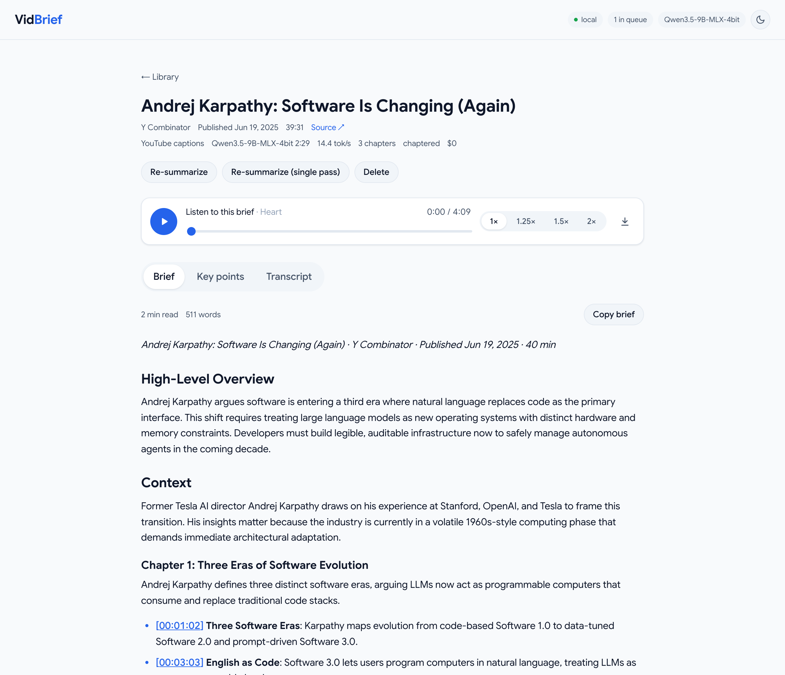
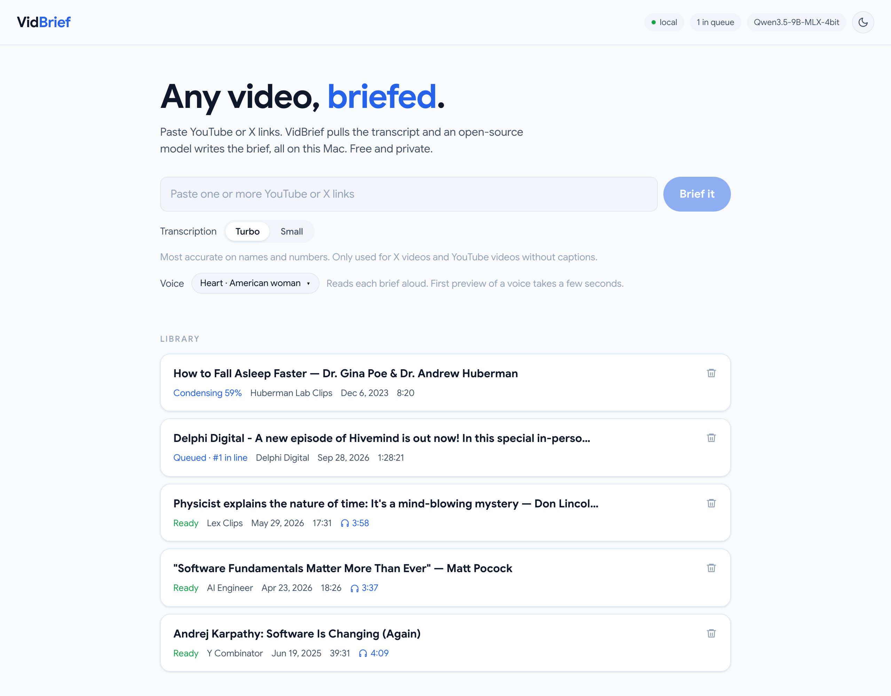
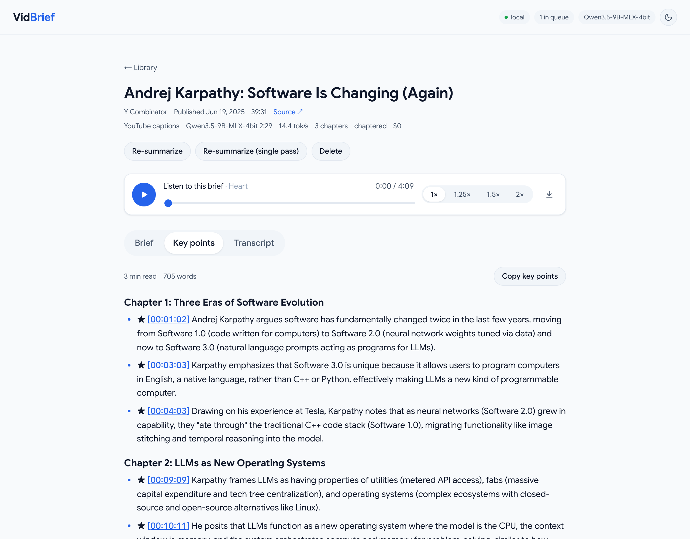

# VidBrief

**Turn any YouTube or X video into a tight, timestamped executive brief, written and read aloud, entirely on your Mac.** · [vidbrief.io](https://vidbrief.io) Open-source models, no API keys, no cost per video, nothing leaves your machine except the video download.

<picture>
  <source media="(prefers-color-scheme: dark)" srcset="docs/screenshots/brief-dark.png">
  
</picture>

## Why

I built [PodBrief](https://podbrief.io) to summarize podcasts and videos with commercial APIs (transcription, Gemini, text-to-speech). I loved using it, but every brief cost money and sent content to third parties. VidBrief does the same core job, a written brief worth reading instead of a 2-hour video, using only open-source tools that run locally on Apple Silicon.

## Features

- **YouTube and X links.** Paste one link or a whole list; they queue and run one at a time.
- **Fast transcripts.** YouTube videos use the video's own captions (seconds, no download). X videos and captionless YouTube videos are transcribed locally with Whisper.
- **Briefs that respect your time.** A high-level overview, context on who's talking, topic-based chapters with clickable timestamps, and key takeaways. Length grows slowly with the video: about 650 words for an hour, never more than 1,250.
- **You decide what matters.** A plain-text priorities file tells the model what to keep (by default: actionable advice, news and numbers, predictions) and what to drop.
- **Listen instead of read.** Every brief is also recorded as audio with a natural open-source voice (Kokoro). Play it at up to 2× speed, or download the MP3. Choose from 28 American and British voices.
- **Key points and full transcript** for every video, in tabs next to the brief.
- **Easy cleanup.** Deleting a brief deletes its audio, transcript and outputs from disk.

<picture>
  <source media="(prefers-color-scheme: dark)" srcset="docs/screenshots/library-dark.png">
  
</picture>

## Requirements

| | |
|---|---|
| Mac | Apple Silicon (M1 or later). **16 GB memory recommended.** |
| Disk | About 8 GB for models, plus a few MB per video |
| Software | macOS with [Homebrew](https://brew.sh), Python 3.10+, Node 18+, espeak-ng |

## Quick start

```bash
brew install python yt-dlp ffmpeg node espeak-ng
git clone https://github.com/victorkung/vidbrief.git
cd vidbrief
./scripts/setup.sh     # creates .venv, installs dependencies, downloads models (~7.8 GB, first time only)
./scripts/dev.sh       # starts the app
```

Open **http://127.0.0.1:5174**, paste a link, and press **Brief it**.

`setup.sh` is safe to re-run. Set `SKIP_MODELS=1` to skip the model download (models are then fetched on first use).

## Using it

### In the app

1. **Paste links.** One link opens its brief as it's made. Several links (one per line, or separated by spaces) queue on the library page. Cards show their place in line, and links already in your library are skipped.
2. **Watch progress.** Each video goes through *captions or download and transcribe → condense → plan chapters → write chapters → summary → recording audio*. Cancel works at any point.
3. **Read or listen.** The Listen bar plays the brief aloud (speed 1–2×, download MP3; works with your keyboard's media keys). The **Brief** tab has the text; timestamps jump to that moment on YouTube. **Key points** lists every important point by chapter (★ marks the most important), and **Transcript** has the full text.
4. **Redo or remove.** **Re-summarize** reruns the summary from the saved transcript, for example after editing your priorities. The trash icon deletes a brief and its files.

The **Transcription** toggle (Turbo or Small) only matters for videos without captions. Turbo is more accurate with names and numbers; Small is faster.

**Voice** picks who reads your briefs: press ▶ on any of the 28 voices to hear a sample, then click one to make it the default. Existing briefs keep their voice until you choose **Re-record** on the brief.

<picture>
  <source media="(prefers-color-scheme: dark)" srcset="docs/screenshots/key-points-dark.png">
  
</picture>

### From the terminal

```bash
.venv/bin/python -m vidbrief "https://www.youtube.com/watch?v=LCEmiRjPEtQ"
# prints the path to brief.md when done
```

Options: `--model <hf-id-or-path>`, `--whisper turbo|small`, `--mode chaptered|single_pass`.

Briefs are saved under `briefs/<date> <channel>/` as `brief.md` and `brief.mp3`, plus `key_points.md`, `transcript.md` and the source transcript.

## How it works

```text
URL ─► transcript ─► condense ─► plan chapters ─► write chapters ─► overview & takeaways ─► brief.md ─► brief.mp3
       YouTube captions,   one line per        1–8 chapters      3–4 bullets each,     from the finished       Kokoro voice
       or yt-dlp audio +   point, ★ on the     by topic          from that chapter's   chapters
       MLX Whisper         most important                        key points only
```

A 9-billion-parameter model running on a laptop follows short, focused instructions far better than one long prompt. So the work is split into small steps, and the code (not the model) assembles the final structure:

1. **Condense:** each ~30-minute stretch of transcript becomes one line per key point, with ★ on actionable advice, news and predictions. Timestamps are then matched back to the transcript in code, so they are always real.
2. **Plan chapters:** one short call groups the points into chapters by topic. Code checks order and balance, and folds very short chapters (such as a teaser cold open) into a neighbour.
3. **Write chapters:** each chapter is written from only its own key points, ★ points first.
4. **Overview, context, takeaways:** one call over the finished chapters. The video's title, channel and description are passed along so the model can fix misspelled names from the captions.

If the brief still runs over its word budget, code drops the least important bullets.

Finally, the brief is rewritten as a narration script (timestamps, markdown and symbols removed; headings become spoken signposts; "5–10" reads "5 to 10", "$200M" reads "$200 million") and recorded with [Kokoro-82M](https://huggingface.co/hexgrad/Kokoro-82M) through [mlx-audio](https://github.com/Blaizzy/mlx-audio). A five-minute read takes about 20–30 seconds to record. If recording fails, the written brief is still ready.

Models run one at a time across every VidBrief process on the Mac (a file lock), and each model is unloaded as soon as its step ends, so Whisper and the LLM never share memory.

## Make it yours

The easiest way to customize VidBrief is to ask your AI coding agent (Claude Code, Codex, Cursor and the like). This README and [`AGENTS.md`](AGENTS.md) are written for agents, so prompts like these work well:

- "Clone https://github.com/victorkung/vidbrief, follow AGENTS.md to install it on my Mac, and start the app."
- "In VidBrief, create `prompts/private/priorities.md` so briefs focus on biotech deals and clinical trial results, keep every number, and skip sponsor reads."
- "Change VidBrief so every brief ends with a short 'What to watch next' section, update the tests, and re-summarize my latest brief."

### What "important" means

Edit [`prompts/priorities.md`](prompts/priorities.md). It's plain English and is included in every summarizing step. The default is written for staying up to date on tech and markets: it keeps actionable advice, news and numbers, predictions, and frameworks, and drops anecdotes, banter, ads and self-promotion.

To keep your changes out of git, copy it to `prompts/private/priorities.md` and edit that. Any prompt in `prompts/` can be overridden the same way: `condense.md`, `chapters.md`, `chapter.md`, `overview.md`, `single_pass.md`.

### Settings

Copy `.env.example` to `.env` and uncomment what you need:

| Setting | Default | What it does |
|---|---|---|
| `LLM_MODEL` | `mlx-community/Qwen3.5-9B-MLX-4bit` | Summarizer. Any [mlx-lm](https://github.com/ml-explore/mlx-lm) model: a Hugging Face id or a local path |
| `WHISPER_MODEL` | `turbo` | `turbo` (most accurate) or `small` (faster). Only used when a video has no captions |
| `TRANSCRIPT_SOURCE` | `auto` | `auto` (captions, else Whisper), `whisper` (always), or `captions` (never Whisper) |
| `SUMMARY_MODE` | `chaptered` | `chaptered` (the steps above) or `single_pass` (one call; fine for short videos) |
| `TTS_ENABLED` | `1` | Set `0` to skip recording audio |
| `TTS_VOICE` | `af_heart` | Default voice (the voice picked in the app takes precedence) |
| `TTS_SPEED` | `1.0` | Speaking rate baked into the MP3 (the player can also speed up) |
| `HF_HOME` | `~/.cache/huggingface` | Where models are stored. An external drive works |
| `BRIEFS_DIR`, `DATA_DIR` | `./briefs`, `./data` | Where briefs and the library index live |
| `YTDLP_COOKIES_FROM_BROWSER` | (none) | `chrome`, `safari`, and so on, if YouTube blocks downloads |

### Choosing a model

| Mac memory | Suggested `LLM_MODEL` | Status |
|---|---|---|
| 16 GB | `mlx-community/Qwen3.5-9B-MLX-4bit` (default, ~6 GB) | **Tested.** Peak memory about 6.7 GB (the Kokoro voice step peaks at about 2.7 GB and runs separately) |
| 8 GB | `mlx-community/gemma-4-e4b-it-4bit` (~5 GB) | Untested. Close other apps |
| 32 GB+ | A larger 4-bit model, such as `mlx-community/Qwen3.8-27B-4bit` (~15 GB) | Untested. Likely better quality, slower |

Compare models on videos you've already transcribed:

```bash
.venv/bin/python scripts/eval.py --models mlx-community/Qwen3.5-9B-MLX-4bit mlx-community/gemma-4-e4b-it-4bit
```

## Performance

Measured on an M5 MacBook with 16 GB and the default settings. Times are for the summarizing steps; fetching YouTube captions adds about 5 seconds.

| Video | Length | Summarize | Brief length (target) |
|---|---|---|---|
| Huberman Lab clip | 10 min | 1.3 min | 440 words (450) |
| Matt Pocock talk | 18 min | 1.6 min | 470 words (450) |
| The DeFi Report | 37 min | 3.3 min | 454 words (525) |
| When Shift Happens interview | 67 min | 5 min | 557 words (691) |
| Delphi Hivemind (X) | 88 min | 4.8 min | 793 words (805) |

Whisper (for videos without captions) adds about 2.5 minutes per hour of audio with `small`; `turbo` is slower but more accurate. Recording audio adds 20–30 seconds per brief (a 4–7 minute MP3 of 2–4 MB).

## Privacy

Everything runs on your Mac, including the voice. The network is used only by yt-dlp (to fetch the video, its captions and its title, channel, date and description) and for the one-time model downloads from Hugging Face. There are no accounts, telemetry or API keys.

## Troubleshooting

| Problem | Fix |
|---|---|
| YouTube download fails with HTTP 403 | `brew upgrade yt-dlp`, then set `YTDLP_COOKIES_FROM_BROWSER=chrome` in `.env` |
| A job says "Waiting for another VidBrief job to finish" | Another VidBrief process (CLI, eval, second server) is using the model; it continues automatically |
| Out of memory or very slow | Close heavy apps, or use a smaller `LLM_MODEL` (see the table above) |
| Names misspelled in a brief | Captions sometimes mishear names; the model fixes them only when they appear in the video's title or description |
| "port already in use" | Something else is on 5174 or 8788. Use other ports: `VIDBRIEF_UI_PORT=5175 VIDBRIEF_API_PORT=8789 ./scripts/dev.sh` |
| "missing .venv" or "node_modules" | Run `./scripts/setup.sh` |
| Audio skips or mangles unusual names | Install espeak-ng (`brew install espeak-ng`); Kokoro uses it for words it doesn't know |
| A brief has no audio | Press **Create audio** on the brief, or run `.venv/bin/python scripts/backfill_audio.py` for all briefs |

## For AI agents

If you are a coding agent setting this up or changing it, use these exact steps. **Read [`AGENTS.md`](AGENTS.md) before making changes.**

```bash
# 1. Prerequisites (macOS, Apple Silicon). Verify:
uname -m                                   # must print arm64
command -v python3 yt-dlp ffmpeg node espeak-ng   # install missing ones: brew install python yt-dlp ffmpeg node espeak-ng

# 2. Install (non-interactive, idempotent). SKIP_MODELS=1 skips the ~7.8 GB model download.
./scripts/setup.sh

# 3. Verify
.venv/bin/python -m pytest -q             # all tests must pass; no network or models needed
.venv/bin/python -m vidbrief "https://www.youtube.com/watch?v=jNQXAC9IVRw"   # 19-second clip, ~1 min; prints brief.md path

# 4. Run the app (API :8788, UI :5174). Blocks; run it in the background if needed.
./scripts/dev.sh
curl -s http://127.0.0.1:8788/api/health   # {"ok": true, ...}
```

**Where things live:**

| Change | Edit |
|---|---|
| What a brief keeps or drops | `prompts/priorities.md` |
| Wording or format of a step | `prompts/condense.md`, `chapters.md`, `chapter.md`, `overview.md` |
| Length targets and chapter counts | `vidbrief/prompts.py` (`target_words`, `section_count`, `bullet_count`) |
| Pipeline stages and resume logic | `vidbrief/pipeline.py` |
| Summarizing steps | `vidbrief/summarize.py` |
| Downloads, captions, Whisper | `vidbrief/media.py`, `scripts/transcribe.py` |
| Read-aloud text cleanup, voices | `vidbrief/speech.py`, `vidbrief/voices.py`, `scripts/tts_run.py` |
| Queue and API endpoints | `vidbrief/api.py` |
| UI | `app/frontend/src/App.jsx`, `styles.css` |

**Never commit** `.env`, `briefs/`, `data/`, `prompts/private/*` (except its README), audio or transcripts.

**HTTP API** (`127.0.0.1:8788`): `POST /api/ingest {url}`, `POST /api/ingest/batch {urls: [...]}`, `GET /api/briefs`, `GET /api/briefs/{id}` (includes `brief_md`, `condensed_md`, `transcript`), `POST /api/briefs/{id}/resummarize {mode}`, `POST /api/briefs/{id}/cancel`, `DELETE /api/briefs/{id}?files=true`, `GET /api/briefs/{id}/audio` (MP3, supports Range), `POST /api/briefs/{id}/voice` (re-record), `GET /api/voices`, `PUT /api/settings/voice {voice}`, `GET /api/voices/{voice}/preview`.

## Development

```bash
.venv/bin/python -m pytest -q          # unit tests: prompts, parsing, queue, delete safety, model lock
.venv/bin/python scripts/eval.py --models <model> [--videos "<folder>"] [--reuse-condensed]
```

```text
vidbrief/          Python package: pipeline, media, summarize, prompts, api, cli
scripts/           setup.sh, dev.sh, serve.sh, llm_run.py (mlx-lm), transcribe.py (Whisper), tts_run.py (Kokoro), eval.py, backfill_*.py
prompts/           the prompts and priorities (override in prompts/private/)
app/frontend/      React UI (Vite)
docs/reference/    PodBrief example briefs, the format and voice VidBrief follows
docs/screenshots/  images used in this README (light and dark)
docs/brand/        logo, favicon and social images
site/              the vidbrief.io landing page (Vite + React, deployed on Vercel: cd site && vercel --prod)
tests/             pytest suite
```

## License and credits

MIT. Built on [MLX](https://github.com/ml-explore/mlx), [mlx-lm](https://github.com/ml-explore/mlx-lm), [mlx-whisper](https://github.com/ml-explore/mlx-examples/tree/main/whisper), [yt-dlp](https://github.com/yt-dlp/yt-dlp), [OpenAI Whisper](https://github.com/openai/whisper) weights, [Qwen](https://huggingface.co/Qwen) models, [Kokoro-82M](https://huggingface.co/hexgrad/Kokoro-82M), [mlx-audio](https://github.com/Blaizzy/mlx-audio), [misaki](https://github.com/hexgrad/misaki) and [eSpeak NG](https://github.com/espeak-ng/espeak-ng). The brief format comes from [PodBrief](https://podbrief.io).
